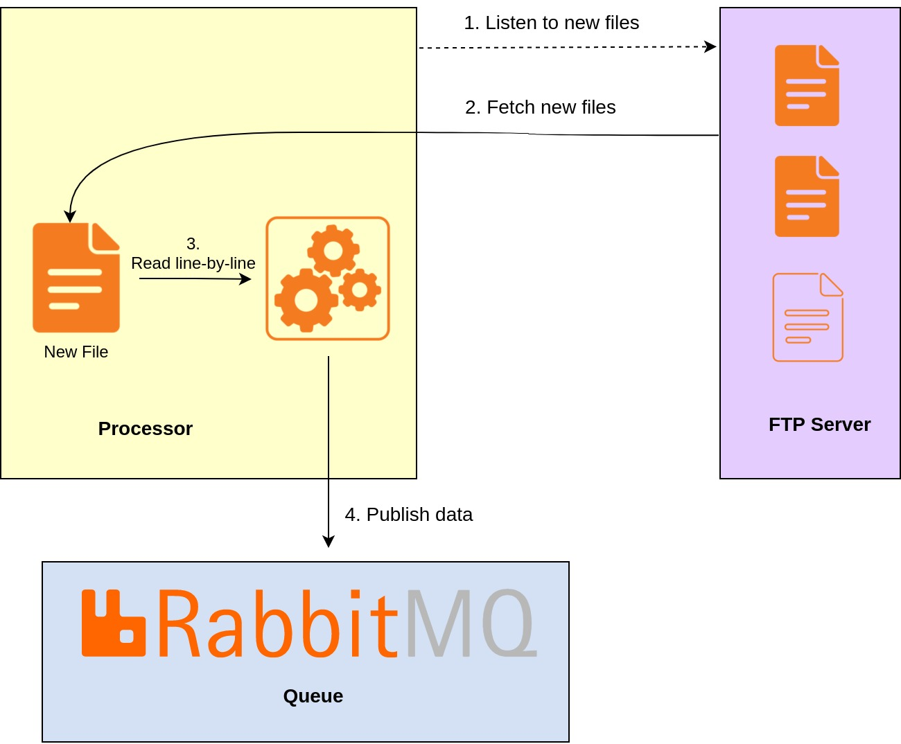

# COVID-19 Statistics Publisher

## Overview

This guide explains how to listen to remotely located files, receive them, process, and publish their content to a RabbitMQ queue using Ballerina.
This example explains how to write a simple file listener using FTP, fetch files using an FTP client, process, and publish them to a RabbitMQ queue.
The figure below illustrates the high-level design diagram of the system.

<div align="center"></div>

Note that the data file is taken from https://ourworldindata.org/covid-vaccinations.

## Implementation

The implementation of the complete scenario is implemented as described below.
- Initially, the FTP listener is listening to an external FTP server for newly available files having the `.csv` extension.
- When such a file is detected, this file is fetched to the local instance using the FTP client.
- Then the file is started to read as a stream.
  - Each line of the CSV file is processed individually, extracting the fields related to,
    1. Country name where the new COVID-19 patients are diagnosed
    2. Date of diagnosis
    3. Total number of patients identified in that day in that country
  - Aggregate the above extracted data and build a JSON serialized to binary.
  - This binary value is published to an external RabbitMQ server.
  - Clean the processed file by deleting it.

## Execution Order

The below are the detailed explanations of each of the steps of this example.

### Step 1 - Start the RabbitMQ Server

Start a RabbitMQ server with default settings so that new queues can be created and data can be published to them.
A Docker image of a RabbitMQ server can be run to quickly start the server.

### Step 2 - Start the FTP Server

Execute the run command of the Ballerina FTP server project. This would start the FTP server.

### Step 3 - Start the Processor

In order to listen to the FTP server, an FTP listener has to be initialized with the file processor.
This will start to listen to the started FTP server for new CSV files, fetch them process them, and publish them.

### Step 4 - Add New Files

Add a CSV file to the `examples/covid19-stat-publisher/sftp-server/src/main/resources/input` location.
This would trigger the FTP listener which would fetch the file from the FTP server to a local location.
Then the newly added file would get processed by an asynchronous method and publish messages to the RabbitMQ queue.


## Testing

### Starting the RabbitMQ Server

First Docker has to be installed to run the RabbitMQ container.
- Use [Docker for Mac](https://docs.docker.com/docker-for-mac/install/) to install on Mac.
- Use [Docker for Windows](https://docs.docker.com/docker-for-windows/) to install on Windows.
- Use [Docker CE](https://docs.docker.com/v17.12/install/#server) to install on Linux.

Then a RabbitMQ server can be run from a Docker image as given below.
```shell
sudo docker run -it --rm --name rabbitmq -p 5672:5672 -p 15672:15672 rabbitmq:3.9-management
```

### Starting the SFTP Server

You can run the server code in your local environment. Navigate to the directory
[`examples/covid19-stat-publisher/sftp-server`](./sftp-server), and execute the command below.
```shell
./gradlew run
```

The successful start of the server should be shown as below.
```shell
INFO: Started the SFTP server
```

### Starting the Processor

Navigate to the [`examples/covid19-stat-publisher/processor`](./processor) directory, and execute the command below.
```shell
$ bal run
```

The successful execution of the processor should start to show from the output below.
```shell
Initialized the process job.
```

### Viewing the Published Messages

You can log in to the RabbitMQ server from http://localhost:15672 using `guest` and `guest` as username and the password.
Then check that the `InfectionQueue` is created in the `Queues` tab.

Now, copy the `examples/covid19-stat-publisher/sftp-server/src/main/resources/datafiles/owid-covid-data.csv` file to the
`examples/covid19-stat-publisher/sftp-server/src/main/resources/input` location. This would publish the messages to the queue
after some time.

After successfully publishing all the events to the queue, there should be 132034 messages in the `InfectionQueue`.
